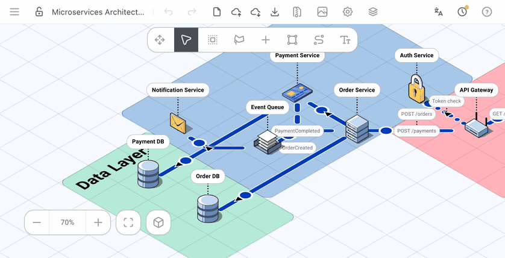
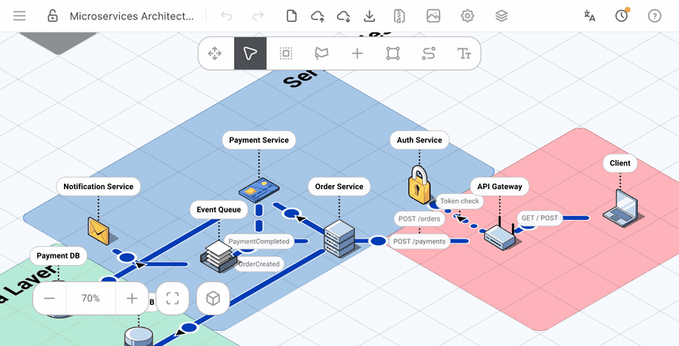

<div align="center">


</div>

<p align="center">
 <a href="../README.md">English</a> | <a href="README.cn.md">简体中文</a> | <a href="README.es.md">Español</a> | <a href="README.pt.md">Português</a> | <a href="README.fr.md">Français</a> | <a href="README.hi.md">हिन्दी</a> | <a href="README.bn.md">বাংলা</a> | <a href="README.ru.md">Русский</a> | <a href="README.id.md">Bahasa Indonesia</a> | <a href="README.de.md">Deutsch</a> | <a href="README.ko.md">한국어</a> | <a href="README.ja.md">日本語</a> | <a href="README.it.md">Italiano</a> | <a href="README.pl.md">Polski</a> | <a href="README.tr.md">Türkçe</a>
</p>

## Uwaga:

To repozytorium (Isenax) jest pochodną [Abrar74774/FossFLOW](https://github.com/Abrar74774/FossFLOW), które samo jest forkiem stan-smith/FossFLOW (a to z kolei forkiem [markmanx/isoflow](https://github.com/markmanx/isoflow)), utworzonym pierwotnie po to, by wnosić zmiany do oryginalnego repozytorium przez PR-y. Nazwa użytkownika autora została jednak najwyraźniej zmieniona na [mug-book-droid](https://github.com/mug-book-droid), a aktywność ustawiona jako prywatna (być może konto zostało zawieszone?), przez co oryginalne repozytorium stało się niedostępne.

Na razie zamierzam prowadzić to repozytorium (obecnie nazwane Isenax) jako kontynuację rozwoju FossFLOW; wszelkie wkłady przez PR-y są mile widziane.

Ostatni pobrany przeze mnie stan oryginalnego repozytorium znajdziesz w gałęzi `backup/stan-smith-FossFLOW`.

---

Isenax to rozbudowana, otwartoźródłowa aplikacja Progressive Web App (PWA) do tworzenia estetycznych diagramów izometrycznych. Zbudowana w oparciu o React i bibliotekę <a href="https://github.com/markmanx/isoflow">Isoflow</a> (sforkowaną i opublikowaną w npm jako fossflow, następnie flowvia, a w tym forku jako isenax), działa w całości w przeglądarce i obsługuje tryb offline.

---
<p align="center">
<b>Wypróbuj online --> https://nyangko.github.io/Isenax/ <-- </b>
</p>


---------

## 🐳 Szybkie wdrożenie z Dockerem

```bash
# Za pomocą Docker Compose (zalecane - zawiera trwały magazyn danych)
docker compose up

# Albo bezpośrednio z Docker Hub z trwałym magazynem danych
docker run -p 80:80 -v $(pwd)/diagrams:/data/diagrams nyangko/isenax:latest
```

Magazyn po stronie serwera jest w Dockerze domyślnie włączony. Diagramy są zapisywane (domyślnie jako root) w katalogu `./diagrams` na hoście. Aby zmienić użytkownika lub grupę zapisu, ustaw zmienne środowiskowe `PUID` i `PGID`.

Aby wyłączyć magazyn po stronie serwera, ustaw `ENABLE_SERVER_STORAGE=false`:
```bash
docker run -p 80:80 -e ENABLE_SERVER_STORAGE=false nyangko/isenax:latest
```

### Uwierzytelnianie HTTP Basic (opcjonalne)

Zabezpiecz swoją instancję Isenax za pomocą HTTP Basic Auth:

```bash
# Z Docker Compose
HTTP_AUTH_USER=admin HTTP_AUTH_PASSWORD=secret docker compose up

# Albo z docker run
docker run -p 80:80 \
  -e HTTP_AUTH_USER=admin \
  -e HTTP_AUTH_PASSWORD=secret \
  nyangko/isenax:latest
```

> **Uwaga**: obie zmienne muszą być ustawione, aby włączyć uwierzytelnianie. Jeśli którakolwiek jest pusta, aplikacja jest dostępna bez logowania.

## Szybki start (rozwój lokalny)

```bash
# Sklonuj repozytorium
git clone https://github.com/nyangko/Isenax
cd Isenax

# Zainstaluj zależności
npm install

# Zbuduj bibliotekę (wymagane za pierwszym razem)
npm run build:lib

# Uruchom serwer deweloperski
npm run dev
```

Otwórz [http://localhost:3000](http://localhost:3000) w przeglądarce.

## Struktura monorepo

To monorepo zawiera cztery pakiety:

- `packages/isenax-lib` - Biblioteka komponentów React do rysowania diagramów sieciowych (budowana za pomocą Rslib/Rspack)
- `packages/isenax-app` - Progressive Web App opakowująca i prezentująca bibliotekę (budowana za pomocą RSBuild)
- `packages/isenax-backend` - Serwer Express zapewniający opcjonalny własny magazyn diagramów (używany we wdrożeniu Docker)
- `packages/isenax-mcp` - Serwer MCP (Model Context Protocol) pozwalający zewnętrznemu agentowi AI bezpośrednio odczytywać, tworzyć i edytować Twoje diagramy (stdio lub Streamable HTTP)

### Polecenia deweloperskie

```bash
# Rozwój
npm run dev          # Uruchom serwer deweloperski aplikacji
npm run dev:lib      # Tryb watch dla rozwoju biblioteki

# Budowanie
npm run build        # Zbuduj bibliotekę i aplikację
npm run build:lib    # Zbuduj tylko bibliotekę
npm run build:app    # Zbuduj tylko aplikację

# Testy i linting
npm test             # Uruchom testy jednostkowe
npm run lint         # Sprawdź błędy lintera

# Testy E2E (Selenium)
cd e2e-tests
./run-tests.sh       # Uruchom testy end-to-end (wymaga Dockera i Pythona)

# Publikacja
npm run publish:lib  # Opublikuj bibliotekę w npm
```

## Jak używać

### Tworzenie diagramów

1. **Dodawanie elementów**:
   - Naciśnij przycisk „+” w menu w prawym górnym rogu — biblioteka komponentów pojawi się po lewej
   - Przeciągnij i upuść komponenty z biblioteki na kanwę
   - Albo kliknij siatkę prawym przyciskiem myszy i wybierz „Dodaj węzeł”

2. **Łączenie elementów**:
   - Wybierz narzędzie łącznika (naciśnij „C” lub kliknij ikonę łącznika)
   - **Tryb klikania** (domyślny): kliknij pierwszy węzeł, potem drugi
   - **Tryb przeciągania** (opcjonalny): kliknij i przeciągnij od pierwszego węzła do drugiego
   - Tryb zmienisz w Ustawieniach → Łączniki

3. **Zapisywanie pracy**:
   - **Szybki zapis** — zapisuje w sesji przeglądarki
   - **Eksport** — pobiera jako plik JSON
   - **Import** — wczytuje z pliku JSON

4. **Porządkowanie w panelu Warstwy**:
   - Otwórz Warstwy z paska narzędzi, aby zobaczyć wszystkie węzły, łączniki, obszary i pola tekstowe na jednej liście
   - Wybierz element z listy, aby edytować go w zakładce „Edytuj” tego samego panelu
   - Na wąskich ekranach panel otwiera się od dołu, przyciskiem w prawym dolnym rogu kanwy

### Opcje przechowywania

- **Magazyn sesji**: tymczasowe zapisy usuwane po zamknięciu przeglądarki
- **Eksport/Import**: trwałe przechowywanie w plikach JSON
- **Autozapis**: automatycznie zapisuje zmiany w sesji co 5 sekund

### Integracja MCP (Agenci AI)

Isenax zawiera serwer MCP, dzięki któremu zewnętrzny agent AI (Claude itp.) może bezpośrednio odczytywać, tworzyć i edytować Twoje diagramy:

1. Otwórz **Ustawienia → MCP** i włącz — pojawi się adres URL połączenia oraz token Bearer.
2. Podłącz swojego klienta MCP pod ten URL/token (`packages/isenax-mcp` obsługuje zarówno transport stdio, jak i Streamable HTTP).
3. Zmiany wprowadzone przez agenta pojawiają się na żywo w każdej otwartej karcie z tym diagramem, bez potrzeby odświeżania — podczas pracy widoczny jest wskaźnik „MCP zapisuje...”.

Wbudowane ikony są przesyłane tylko przez id (dane base64 nie są wysyłane do agenta), a `update_diagram_patch` pozwala agentowi wysyłać tylko zmienione pola zamiast całego modelu.

## Ostatnio dodane

### Przeprojektowane ustawienia
Przeszukiwalne (⌘K) okno ustawień w układzie dwupanelowym zastępuje dawny pasek zakładek — pogrupowane w Skróty/Przesuwanie/Zoom, Wyświetlanie, Pakiety ikon i Rozszerzenia, z logiką Anuluj/Zapisz oraz przyciskiem „Przywróć domyślne” w każdej sekcji.

### Panel Warstwy
Filtry wyszukiwania i typu (Wszystkie/Węzły/Łączniki/Obszary/Tekst), węzły zagnieżdżone pod obszarem, w którym się znajdują, przełączniki pokaż/zablokuj dla każdego elementu, a panel teraz przylega równo do krawędzi ekranu, z konfigurowalną pozycją paska narzędzi.

### Panel edycji węzła
Przeprojektowana karta podsumowania z większą ikoną, odznaką zaznaczenia, chipami strefy/połączenia/typu, trybem wyświetlania etykiety (Zawsze/Po najechaniu/Ukryta) oraz Podsumowaniem połączeń, które przenosi widok kanwy do połączonego węzła po kliknięciu.

### Integracja narzędzi MCP
Panel Ustawienia → MCP wyświetla teraz listę narzędzi (list/get/create/update/patch/delete diagram), które może wywołać podłączony agent AI.

### Logo marek w pakietach ikon
Pakiety ikon AWS, GCP, Azure i Kubernetes pokazują teraz w Ustawieniach prawdziwe logo marki zamiast ogólnej odznaki z inicjałem.

### Multipleksowanie łączników


### Kopiowanie i wklejanie elementów


## Współtworzenie

Chętnie przyjmujemy wkład! Wytyczne znajdziesz w [CONTRIBUTING.md](../CONTRIBUTING.md).

## Dokumentacja

- [ISENAX_ENCYCLOPEDIA.md](ISENAX_ENCYCLOPEDIA.md) - Obszerny przewodnik po kodzie
- [CONTRIBUTING.md](../CONTRIBUTING.md) - Wytyczne dla współtwórców

## Licencja

MIT
