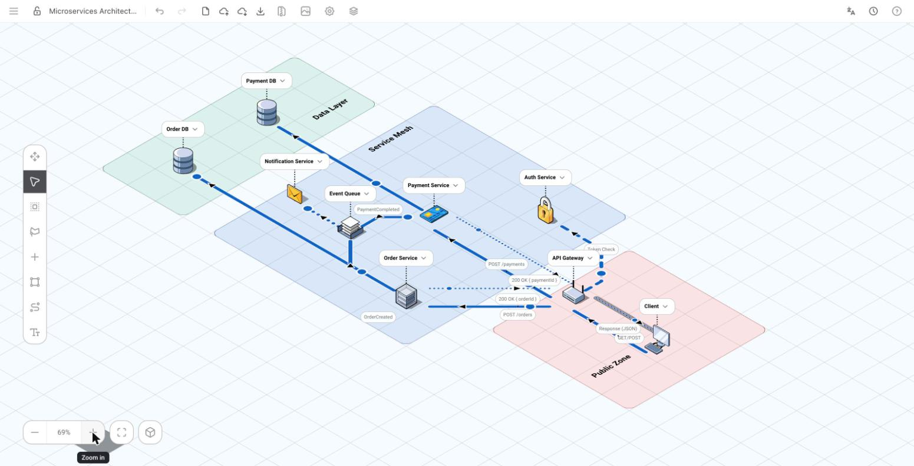

<div align="center">


</div>

<p align="center">
 <a href="../README.md">English</a> | <a href="README.cn.md">简体中文</a> | <a href="README.es.md">Español</a> | <a href="README.pt.md">Português</a> | <a href="README.fr.md">Français</a> | <a href="README.hi.md">हिन्दी</a> | <a href="README.bn.md">বাংলা</a> | <a href="README.ru.md">Русский</a> | <a href="README.id.md">Bahasa Indonesia</a> | <a href="README.de.md">Deutsch</a> | <a href="README.ko.md">한국어</a> | <a href="README.ja.md">日本語</a> | <a href="README.it.md">Italiano</a> | <a href="README.pl.md">Polski</a> | <a href="README.tr.md">Türkçe</a>
</p>

## Not:

Bu depo (Isenax), kendisi de stan-smith/FossFLOW'un bir çatalı olan (o da [markmanx/isoflow](https://github.com/markmanx/isoflow) çatalıydı) [Abrar74774/FossFLOW](https://github.com/Abrar74774/FossFLOW) projesinden türetilmiştir; başlangıçta PR'lar aracılığıyla özgün depoya katkı sağlamak amacıyla oluşturulmuştu. Ancak yazarın kullanıcı adı [mug-book-droid](https://github.com/mug-book-droid) olarak değiştirilmiş ve etkinliği gizliye alınmış görünüyor (hesap askıya alınmış olabilir), bu da özgün depoyu erişilemez kıldı.

Şimdilik bu depoyu (artık Isenax adıyla) FossFLOW geliştirmesinin devamı olarak sürdürmeyi planlıyorum; PR yoluyla gelen katkılar da memnuniyetle karşılanır.

Özgün deponun çektiğim son hâline `backup/stan-smith-FossFLOW` dalından ulaşabilirsiniz.

---

Isenax, güzel izometrik diyagramlar oluşturmak için geliştirilmiş güçlü, açık kaynaklı bir Progressive Web App'tir (PWA). React ve <a href="https://github.com/markmanx/isoflow">Isoflow</a> kütüphanesi (çatallanıp npm'de önce fossflow, sonra flowvia, bu çatalda ise isenax olarak yayımlandı) ile geliştirilmiştir; tamamen tarayıcınızda çalışır ve çevrimdışı desteği vardır.

---
<p align="center">
<b>Çevrimiçi deneyin --> https://nyangko.github.io/Isenax/ <-- </b>
</p>



---------

## 🐳 Docker ile hızlı dağıtım

```bash
# Docker Compose ile (önerilir - kalıcı depolama içerir)
docker compose up

# Veya kalıcı depolama ile doğrudan Docker Hub'dan çalıştırın
docker run -p 80:80 -v $(pwd)/diagrams:/data/diagrams nyangko/isenax:latest
```

Sunucu tarafı depolama Docker'da varsayılan olarak etkindir. Diyagramlarınız ana makinede `./diagrams` dizinine (varsayılan olarak root kullanıcısıyla) kaydedilir. Kaydetme sırasında kullanılacak kullanıcı veya grup kimliğini değiştirmek için `PUID` ve `PGID` ortam değişkenlerini ayarlayın.

Sunucu tarafı depolamayı kapatmak için `ENABLE_SERVER_STORAGE=false` ayarlayın:
```bash
docker run -p 80:80 -e ENABLE_SERVER_STORAGE=false nyangko/isenax:latest
```

### HTTP Basic Kimlik Doğrulama (isteğe bağlı)

Isenax örneğinizi HTTP Basic Auth ile koruyun:

```bash
# Docker Compose ile
HTTP_AUTH_USER=admin HTTP_AUTH_PASSWORD=secret docker compose up

# Veya docker run ile
docker run -p 80:80 \
  -e HTTP_AUTH_USER=admin \
  -e HTTP_AUTH_PASSWORD=secret \
  nyangko/isenax:latest
```

> **Not**: Kimlik doğrulamanın etkinleşmesi için her iki değişken de ayarlanmalıdır. Biri boşsa uygulamaya giriş yapmadan erişilebilir.

## Hızlı başlangıç (yerel geliştirme)

```bash
# Depoyu klonlayın
git clone https://github.com/nyangko/Isenax
cd Isenax

# Bağımlılıkları kurun
npm install

# Kütüphaneyi derleyin (ilk seferde gereklidir)
npm run build:lib

# Geliştirme sunucusunu başlatın
npm run dev
```

Tarayıcınızda [http://localhost:3000](http://localhost:3000) adresini açın.

## Monorepo yapısı

Bu monorepo dört paket içerir:

- `packages/isenax-lib` - Ağ diyagramları çizmek için React bileşen kütüphanesi (Rslib/Rspack ile derlenir)
- `packages/isenax-app` - Kütüphaneyi saran ve sunan Progressive Web App (RSBuild ile derlenir)
- `packages/isenax-backend` - Diyagramlar için isteğe bağlı kendi sunucunuzda depolama sağlayan Express sunucusu (Docker dağıtımında kullanılır)
- `packages/isenax-mcp` - Harici bir AI ajanının diyagramlarınızı doğrudan okumasını, oluşturmasını ve düzenlemesini sağlayan MCP (Model Context Protocol) sunucusu (stdio veya Streamable HTTP)

### Geliştirme komutları

```bash
# Geliştirme
npm run dev          # Uygulama geliştirme sunucusunu başlat
npm run dev:lib      # Kütüphane geliştirme için izleme modu

# Derleme
npm run build        # Kütüphaneyi ve uygulamayı derle
npm run build:lib    # Yalnızca kütüphaneyi derle
npm run build:app    # Yalnızca uygulamayı derle

# Test ve linting
npm test             # Birim testlerini çalıştır
npm run lint         # Lint hatalarını kontrol et

# E2E testleri (Selenium)
cd e2e-tests
./run-tests.sh       # Uçtan uca testleri çalıştır (Docker ve Python gerekir)

# Yayımlama
npm run publish:lib  # Kütüphaneyi npm'e yayımla
```

## Nasıl kullanılır

### Diyagram oluşturma

1. **Öğe ekleme**:
   - Sağ üstteki menüden "+" düğmesine basın, bileşen kütüphanesi solda açılır
   - Bileşenleri kütüphaneden tuvale sürükleyip bırakın
   - Veya ızgaraya sağ tıklayıp "Düğüm ekle" seçeneğini seçin

2. **Öğeleri bağlama**:
   - Bağlayıcı aracını seçin ('C' tuşuna basın veya bağlayıcı simgesine tıklayın)
   - **Tıklama modu** (varsayılan): önce ilk düğüme, sonra ikinci düğüme tıklayın
   - **Sürükleme modu** (isteğe bağlı): ilk düğümden ikincisine sürükleyin
   - Modu Ayarlar → Bağlayıcılar sekmesinden değiştirin

3. **Çalışmanızı kaydetme**:
   - **Hızlı kaydet** - Tarayıcı oturumuna kaydeder
   - **Dışa aktar** - JSON dosyası olarak indirir
   - **İçe aktar** - JSON dosyasından yükler

4. **Katmanlar paneliyle düzenleme**:
   - Tuvaldeki tüm düğümleri, bağlayıcıları, alanları ve metin kutularını tek bir listede görmek için araç çubuğundan Katmanlar'ı açın
   - Listeden bir öğe seçtiğinizde aynı panelin "Düzenle" sekmesinde hemen düzenleyebilirsiniz
   - Dar ekranlarda panel, tuvalin sağ alt köşesindeki düğmeyle alttan açılır

### Depolama seçenekleri

- **Oturum depolaması**: Tarayıcı kapatıldığında silinen geçici kayıtlar
- **Dışa/İçe aktarma**: JSON dosyaları olarak kalıcı depolama
- **Otomatik kaydetme**: Değişiklikleri her 5 saniyede bir oturuma kaydeder

### MCP Entegrasyonu (AI Ajanları)

Isenax, harici bir AI ajanının (Claude vb.) diyagramlarınızı doğrudan okuyabilmesi, oluşturabilmesi ve düzenleyebilmesi için bir MCP sunucusuyla birlikte gelir:

1. **Ayarlar → MCP**'yi açın ve etkinleştirin — bir bağlantı URL'si ve Bearer token gösterilir.
2. MCP istemcinizi bu URL/token ile bağlayın (`packages/isenax-mcp` hem stdio hem de Streamable HTTP taşımasını destekler).
3. Ajanın yaptığı değişiklikler, o diyagramı gösteren herhangi bir açık sekmede yenileme gerekmeden anında görünür — çalışma sırasında "MCP yazıyor..." göstergesi belirir.

Yerleşik simgeler yalnızca id ile aktarılır (ajana base64 verisi gönderilmez) ve `update_diagram_patch`, ajanın tüm modeli yeniden göndermek yerine yalnızca değiştirdiği alanları göndermesini sağlar.

## Yakın zamanda eklenenler

### Detay görünümlerine derinlemesine inme
Bir düğüme sağ tıklayın (mobilde uzun basın) → "Alt Görünüm Oluştur" ile o öğeye ait ayrıntı diyagramına yakınlaşın. Çapa simgesi yerinde kilitli kalır ve silinemez, böylece hangi görünümde olduğunuzu her zaman bilirsiniz; Katmanlar panelinin başlığı aynı zamanda geri düğmesi görevi görür. Katmanlar panelindeki her düğüm satırında artık aynı işlev için kendi oluştur/aç simgesi de var.

### Daha net seçim geri bildirimi
Bir düğümü seçmek artık diğer tüm düğümleri soluklaştırarak seçili olanın öne çıkmasını sağlıyor, bir bağlayıcıyı seçmek yalnızca uç noktalarını değil çizginin kendisini de tuval üzerinde vurguluyor, ve Katmanlar panelinde zaten seçili bir satıra tekrar tıklamak seçimi kaldırıyor.

### Mobilde duyarlı araç çubuğu ve Ayarlar
Üst araç çubuğu artık dar ekranlarda, kayıtlı konum ayarından bağımsız olarak otomatik olarak yatay düzene geçiyor; Ayarlar da mobilde tam ekran açılıyor ve kenar çubuğu listesi yerine yatay kaydırılabilir simge şeridi gezinmesi kullanıyor.

### Yeniden tasarlanan Ayarlar
Aranabilir (⌘K), iki bölmeli ayarlar penceresi eski sekme şeridinin yerini aldı — Kısayollar/Kaydırma/Yakınlaştırma, Görünüm, Simge Paketleri ve Uzantılar olarak gruplandı; her bölümde İptal/Kaydet mantığı ve "Varsayılanlara sıfırla" düğmesi var.

### Katmanlar paneli
Arama ve tür filtreleri (Tümü/Düğümler/Bağlayıcılar/Alanlar/Metin), düğümler artık içinde bulundukları alanın altında iç içe gösteriliyor, öğe başına göster/kilitle geçişleri ve panel artık ekranın kenarına tam yaslanarak yerleşiyor; araç çubuğunun konumu da özelleştirilebiliyor.

### Düğüm düzenleme paneli
Daha büyük bir simge, seçim rozeti, bölge/bağlantı/tür etiketleri, bir Etiket Görüntüleme modu (Her Zaman/Üzerine Gelince/Gizli) ve tıklandığında tuvali bağlı düğüme götüren bir Bağlantı Özeti içeren yeniden tasarlanmış özet kartı.

### MCP araç entegrasyonu
Ayarlar → MCP paneli artık bağlı bir AI ajanının çağırabileceği araçları ( list/get/create/update/patch/delete diagram) listeliyor.

### Simge paketi marka logoları
AWS, GCP, Azure ve Kubernetes simge paketleri, Ayarlar'da artık genel bir baş harf rozeti yerine gerçek marka logolarını gösteriyor.

### Bağlayıcı çoğullama


### Öğeleri kopyalama ve yapıştırma


## Katkıda bulunma

Katkılarınızı bekliyoruz! Yönergeler için [CONTRIBUTING.md](../CONTRIBUTING.md) dosyasına bakın.

## Belgeler

- [ISENAX_ENCYCLOPEDIA.md](ISENAX_ENCYCLOPEDIA.md) - Kod tabanına kapsamlı rehber
- [CONTRIBUTING.md](../CONTRIBUTING.md) - Katkı yönergeleri

## Lisans

MIT
